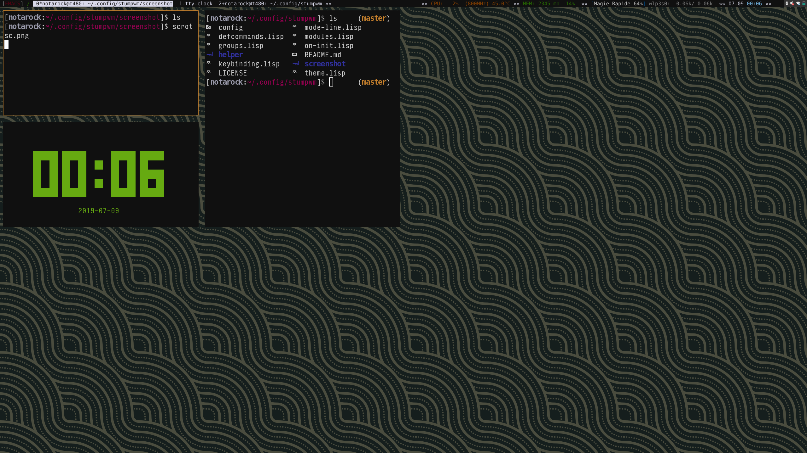

# Notarock's StumpWM Configurations

[Everything has moved here](https://github.com/notarock/dotfiles/tree/master/notarock/stumpwm)

Configuration files for the [Stump Window Manager](https://github.com/stumpwm/stumpwm)

    ├── config
    ├── defcommands.lisp
    ├── groups.lisp
    ├── helper
    │   ├── confirm-command.lisp
    │   ├── web-jump.lisp
    │   └── xrandr.lisp
    ├── keybinding.lisp
    ├── mode-line.lisp
    ├── modules.lisp
    ├── on-init.lisp
    └── theme.lisp
